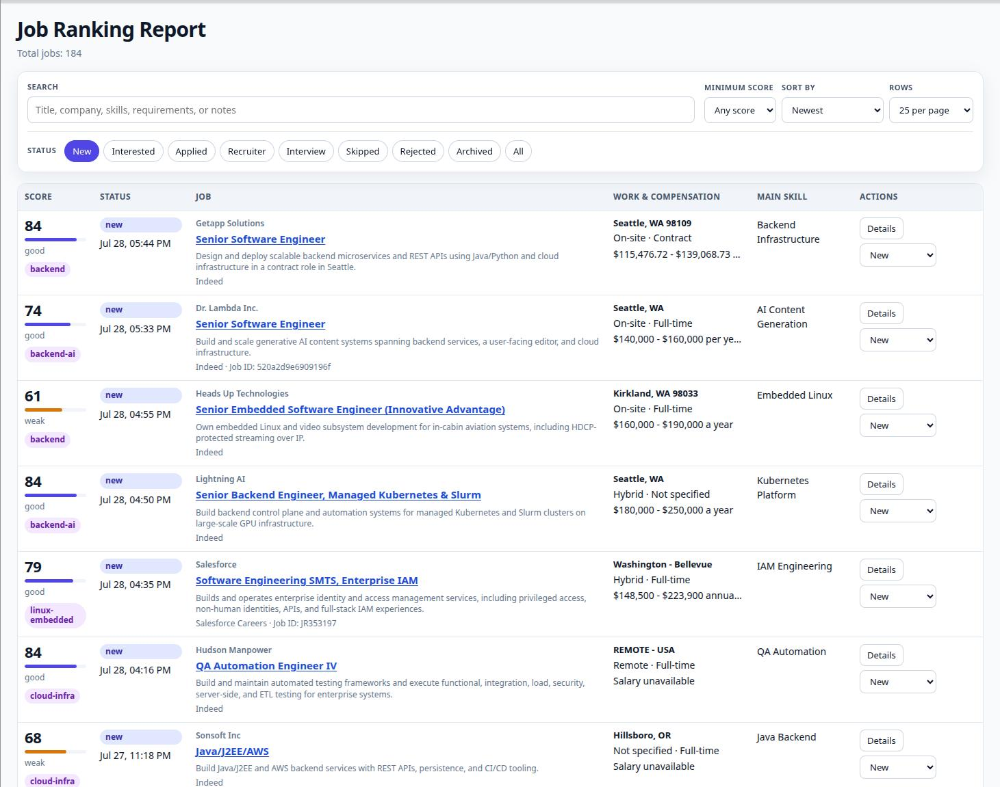

# JobRanker

Local AI-powered job ranking and application workflow tool.

JobRanker helps you collect job postings directly from your browser, extract structured information using AI, rank opportunities against your interests, and manage your application workflow locally.



---

# Features

- Browser extension for capturing job postings
- AI-powered job extraction and ranking
- Local-first SQLite architecture
- Searchable, paginated web dashboard
- Application workflow tracking
- Resume profile support
- SQLite-backed background processing queue
- AI token and cost tracking
- Simple setup with shell scripts

---

# Architecture

```text
Browser Extension
        ↓
FastAPI Capture API
        ↓
SQLite jobs, artifacts, and queue
        ↓
AI Extraction + Ranking Worker
        ↓
SQLite rankings and workflow state
        ↓
API-driven Web Report
```

FastAPI and the worker share `data/jobranker.db`. The browser extension
captures the active page, the worker processes pending queue entries, and the
report loads job summaries and details from the API.

---

# Requirements

- Python 3.11+
- Node.js + npm
- OpenAI API key
- Linux or macOS

---

# Setup

Clone repository:

```bash
git clone https://github.com/vesapehkonen/jobranker.git
cd jobranker
```

Run setup:

```bash
./setup.sh
```

The setup script will:

- Create Python virtual environment
- Install Python dependencies
- Install and build browser extension
- Create `.env`
- Generate API token

Edit `.env` and add your OpenAI API key:

```env
OPENAI_API_KEY=your-api-key
OPENAI_JOB_EXTRACT_MODEL=gpt-5.4-nano
OPENAI_JOB_RANK_MODEL=gpt-5.4-mini
OPENAI_RESUME_EXTRACT_MODEL=gpt-5.4-mini
```

`setup.sh` generates `API_TOKEN` automatically. The API and browser extension
use it to authorize capture and workflow updates.

---

## Add Resume Profile

Resume profiles are stored in SQLite and used for AI-powered job ranking. Source resumes must be in text format (`.txt` or `.md`).

Add a resume profile using:

```bash
source .venv/bin/activate
set -a
source .env
set +a
python extract_resume_ai.py <profile-name> <resume-file>
```

This extracts the structured profile and stores both it and the resume text in `data/jobranker.db`.

---

# Start

Run:

```bash
./start.sh
```

This will:

- Start FastAPI server
- Start worker process
- Initialize or upgrade the SQLite schema
- Open dashboard automatically

Dashboard URL:

```text
http://127.0.0.1:8000/report
```

---

# Browser Extension Setup

After running `setup.sh`:

1. Open browser extensions page
2. Enable Developer Mode
3. Click **Load unpacked**
4. Select the `extension` directory

When capturing the first job posting, the extension will ask for the API token.

Copy `API_TOKEN` from `.env` and paste it into the extension prompt.

You can now capture a job posting from the active browser page.

---

# Development

## Build Browser Extension

```bash
cd extension
npm install
npx tsc
```

## Backend

```bash
source .venv/bin/activate
set -a
source .env
set +a
uvicorn app:app --reload
```

## Worker

```bash
source .venv/bin/activate
set -a
source .env
set +a
python worker.py
```

## Tests

```bash
.venv/bin/python -m unittest discover -v
```

## AI Usage Report

```bash
.venv/bin/python ai_cost_report.py
```

This prints recorded OpenAI calls, token usage, and estimated costs from
SQLite.

---

# Project Structure

```text
jobranker/
├── app.py
├── database.py
├── worker.py
├── report_data.py
├── extract_job_ai.py
├── extract_resume_ai.py
├── rank_job_ai.py
├── migrations/
├── templates/
│   └── jobs_report.html
├── static/
│   ├── jobs-report.css
│   └── jobs-report.js
├── extension/
│   ├── src/
│   ├── dist/
│   └── manifest.json
├── tests/
├── data/
│   └── jobranker.db
├── setup.sh
├── start.sh
└── requirements.txt
```

---

# Security Notes

- Capture and workflow mutation endpoints use a bearer token
- Some report and read-only endpoints are currently unauthenticated
- Backend binds to localhost by default
- No cloud storage
- Job data and resume profiles stay in local SQLite storage
- Resume and job content is sent to OpenAI for extraction and ranking

---

# Future Ideas

- Better recommendation engine
- Resume tailoring
- Cover letter generation
- Company memory/history
- Better duplicate detection
- Docker support
- Optional PostgreSQL backend

---

# License

MIT License

Copyright (c) 2026

Permission is hereby granted, free of charge, to any person obtaining a copy
of this software and associated documentation files (the "Software"), to deal
in the Software without restriction, including without limitation the rights
to use, copy, modify, merge, publish, distribute, sublicense, and/or sell
copies of the Software, and to permit persons to whom the Software is
furnished to do so, subject to the following conditions:

The above copyright notice and this permission notice shall be included in all
copies or substantial portions of the Software.

THE SOFTWARE IS PROVIDED "AS IS", WITHOUT WARRANTY OF ANY KIND, EXPRESS OR
IMPLIED, INCLUDING BUT NOT LIMITED TO THE WARRANTIES OF MERCHANTABILITY,
FITNESS FOR A PARTICULAR PURPOSE AND NONINFRINGEMENT. IN NO EVENT SHALL THE
AUTHORS OR COPYRIGHT HOLDERS BE LIABLE FOR ANY CLAIM, DAMAGES OR OTHER
LIABILITY, WHETHER IN AN ACTION OF CONTRACT, TORT OR OTHERWISE, ARISING FROM,
OUT OF OR IN CONNECTION WITH THE SOFTWARE OR THE USE OR OTHER DEALINGS IN THE
SOFTWARE.
